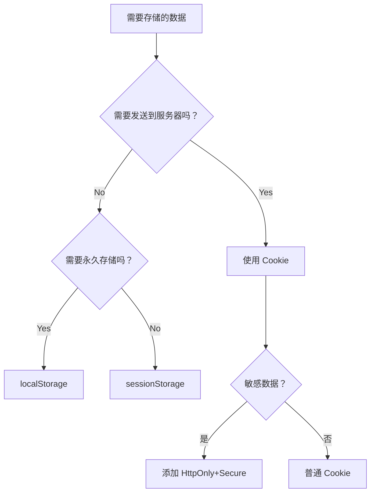

# Web存储

## Web Storage

**两种客户端存储机制：**

- **localStorage**
  - 适合存储：用户偏好设置、长期登录状态、缓存数据
- **sessionStorage**
  - 适合存储：表单暂存、单页面会话状态、临时数据传递

| 特性           | `localStorage` | `sessionStorage` |
| :----------- | :------------- | :--------------- |
| **生命周期**     | 永久存储（除非手动清除）   | 会话结束（标签页关闭）即删除   |
| **作用域**      | 同源窗口共享         | **仅限当前标签页**      |
| **多标签页数据共享** | ✅ 是            | ❌ 否              |


**核心API：**

```js
// 保存数据（键值均为字符串）
localStorage.setItem("key", "value");
sessionStorage.setItem("user", JSON.stringify({name: "Alice"}));

// 读取数据
const data = localStorage.getItem("key");
const user = JSON.parse(sessionStorage.getItem("user"));

// 删除单项
localStorage.removeItem("key");

// 清空所有数据
sessionStorage.clear();

// 获取第n个键名
const firstKey = localStorage.key(0);
```


**关键特性：**

1. **数据类型**

   - 只支持字符串（存储对象需用`JSON.stringify()`）
   - 读取时用`JSON.parse()`解析

1. **存储事件监听**

   - 当其他同源页面==修改存储==时触发：
   ```js
   window.addEventListener("storage", (event) => {
     console.log("变更的键:", event.key);
     console.log("旧值:", event.oldValue);
     console.log("新值:", event.newValue);
     console.log("触发页面:", event.url);
   });
   ```

   - 注意：**当前页面修改不会触发该事件**

3. **容量限制**

   - 各浏览器不同（通常5-10MB）
   - 超出限制会抛出`QuotaExceededError`异常


## Cookie

Cookie 是存储在用户浏览器中的小型文本数据，用于**在客户端持久化存储信息**。


**基础特性：**

| 特性         | 说明                                         |
| :----------- | :------------------------------------------- |
| **存储容量** | 单个域名限制约 **4KB**（不同浏览器有差异）   |
| **数量限制** | 每个域名约 **50个** Cookie（不同浏览器不同） |
| **生命周期** | 可设置过期时间（默认会话结束时失效）         |
| **作用域**   | 通过 `Domain` 和 `Path` 控制可见范围         |
| **传输方式** | 每次 HTTP 请求自动携带（Header 中）          |
| **同源策略** | 仅同源页面可访问（协议+域名+端口相同）       |


**关键属性详解：**

| 属性           | 作用                      | 示例                            |
| :----------- | :---------------------- | :---------------------------- |
| **Expires**  | 绝对过期时间（GMT 格式）          | `Expires=Wed, 21 Oct 2025...` |
| **Max-Age**  | 相对过期时间（秒），优先级高于 Expires | `Max-Age=3600`（1小时）           |
| **Domain**   | 指定生效域名（默认当前域名）          | `Domain=.example.com`         |
| **Path**     | 指定 URL 路径（默认当前路径）       | `Path=/products`              |
| **Secure**   | 仅通过 HTTPS 传输            | `Secure`                      |
| **HttpOnly** | 禁止 JavaScript 访问（防 XSS） | `HttpOnly`                    |
| **SameSite** | 控制跨站请求时是否发送 Cookie      | `SameSite=Strict/Lax/None`    |


**SameSite 策略**

| 值         | 行为描述                                        | 使用场景                 |
| :--------- | :---------------------------------------------- | :----------------------- |
| **Strict** | 完全禁止跨站发送 Cookie（包括页面跳转）         | 银行操作等高敏感场景     |
| **Lax**    | 允许安全的跨站请求（如 `<a>` 链接跳转，默认值） | 大多数用户认证场景       |
| **None**   | 允许所有跨站请求（必须配合 `Secure` 属性）      | 需要跨站嵌入的第三方服务 |

**使用场景：**
1. **用户身份认证**（Session ID）
2. **个性化设置存储**（语言/主题偏好）
3. **购物车信息暂存**
4. **用户行为跟踪**（需符合隐私政策）
5. **跨页面数据传递**


## 总结对比表


### **技术特性对比**

| **特性**      | **Cookie**                        | **localStorage**              | **sessionStorage**  |
| ----------- | --------------------------------- | ----------------------------- | ------------------- |
| **存储容量**    | ≈4KB (单个域名)                       | ≈5-10MB (不同浏览器)               | ≈5-10MB (不同浏览器)     |
| **生命周期**    | **可设置过期时间** (默认会话结束)              | **永久存储** (需手动删除)              | **会话级存储** (标签页关闭消失) |
| **网络传输**    | ✅ 每次请求自动携带 (增加流量)                 | ❌ 不参与                         | ❌ 不参与               |
| **访问权限**    | 前后端均可访问                           | **仅前端 JS 访问**                 | **仅前端 JS 访问**       |
| **同源策略**    | 支持跨子域 (`Domain=.site.com`)        | 严格同源 (协议+域名+端口)               | 严格同源 (协议+域名+端口)     |
| **数据共享**    | 同源所有标签页共享                         | 同源所有标签页共享                     | **仅当前标签页**          |
| **API 易用性** | 需手动解析字符串                          | 简单键值对 API (`setItem/getItem`) | 简单键值对 API           |
| **安全防护**    | 支持 `HttpOnly`、`Secure`、`SameSite` | 无内置安全机制                       | 无内置安全机制             |

### 安全对比

| **风险**      | **Cookie**                | **Web Storage**    |
| ----------- | ------------------------- | ------------------ |
| **XSS 攻击**  | 可通过 `HttpOnly` 防御         | **完全暴露** (脚本可任意读取) |
| **CSRF 攻击** | 需配合 `SameSite` 和 Token 防御 | **天然免疫** (不发送到服务器) |
| **数据窃取**    | 需 `Secure` 属性强制 HTTPS     | 依赖页面 HTTPS 安全      |
| **敏感数据**    | 可存储加密后的认证令牌               | **禁止存储敏感信息**       |


## 结论选择指南


 **适用场景决策树：**




**适用需求：**

| **需求**       | **推荐方案**              |
| :----------- | :-------------------- |
| 用户认证/会话管理    | **Cookie (HttpOnly)** |
| 长期保存客户端偏好    | **localStorage**      |
| 单标签页临时数据     | **sessionStorage**    |
| >4KB 非敏感数据   | **localStorage**      |
| 需要服务器读取的数据   | **Cookie**            |
| 防 CSRF 的敏感数据 | **Cookie (SameSite)** |
| 防 XSS 的敏感数据  | **Cookie (HttpOnly)** |

**黄金准则**：

- 需要**网络传输** → Cookie
- 纯**客户端存储** → Web Storage
- **敏感信息** → 优先 Cookie + 安全属性
- **大数据量** → Web Storage 或 IndexedDB